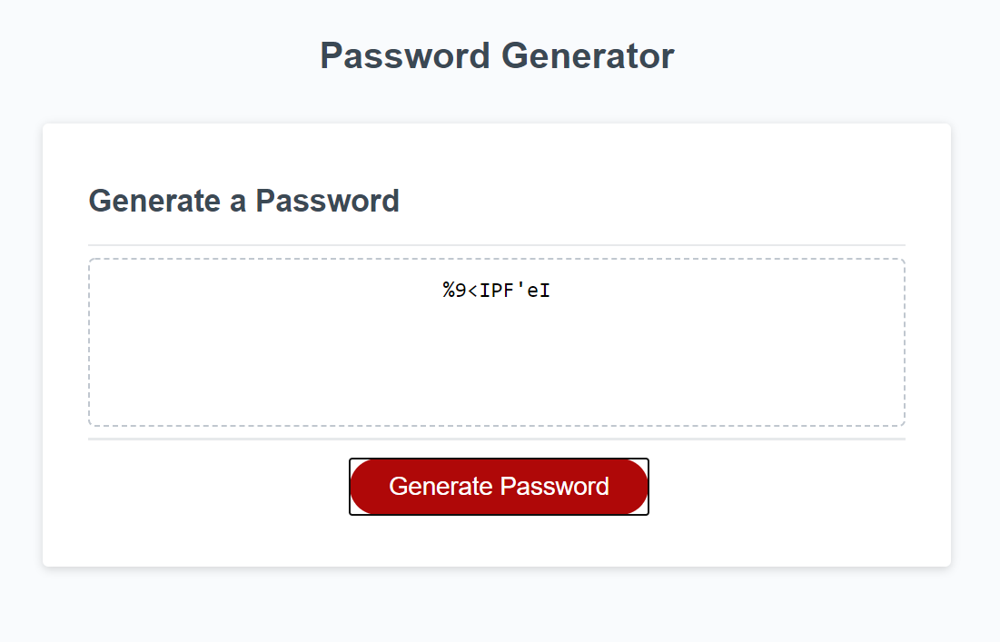

# Password Generator

## Description:

Uses Javascript to generate a random password according to specified inputs from a user to determine the length and characters used in the password.

## Screenshoot of website:

## Link to live website:

(https://richardthopkins.github.io/Password-Generator/)

